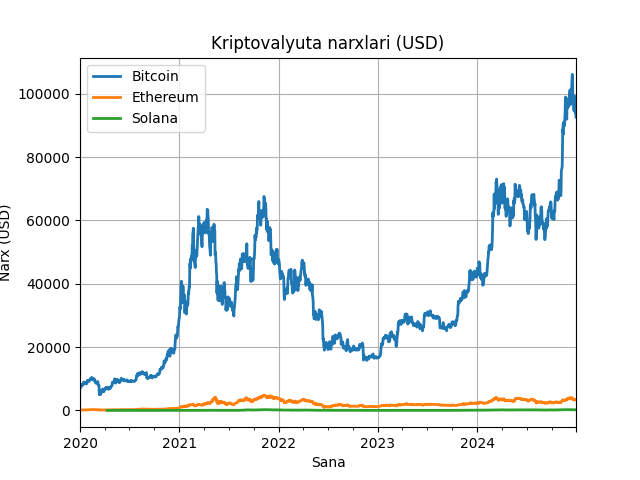
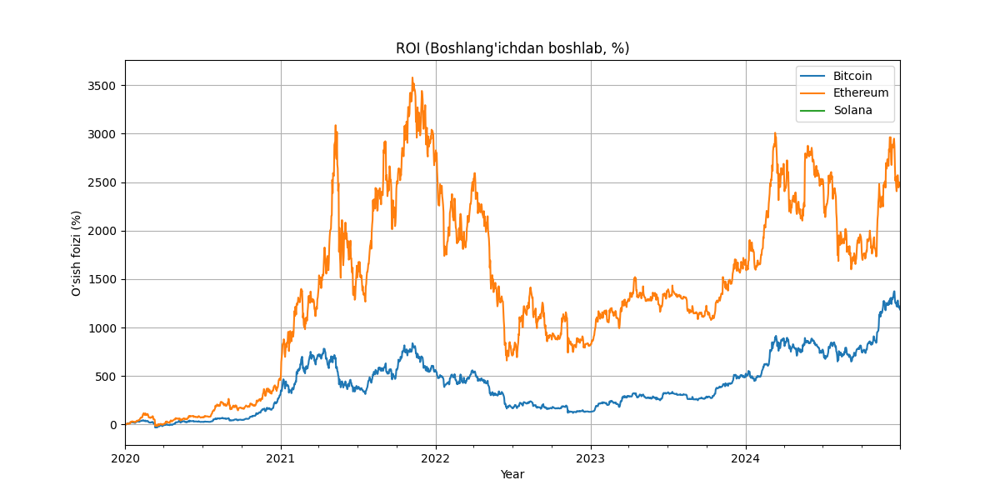
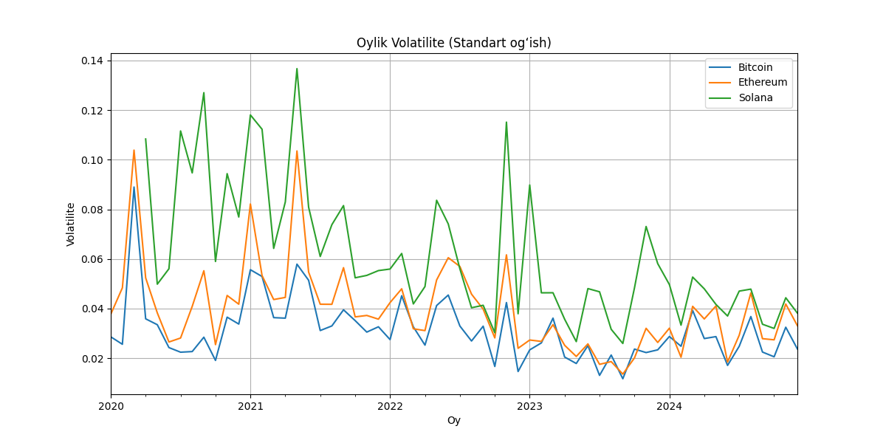
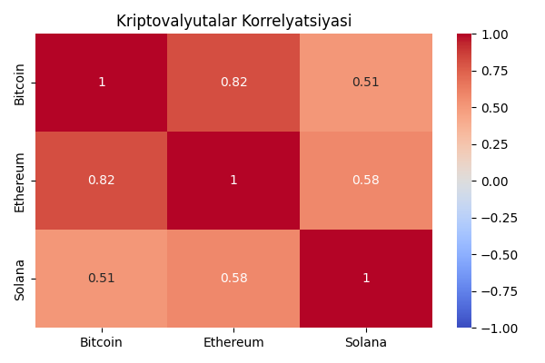
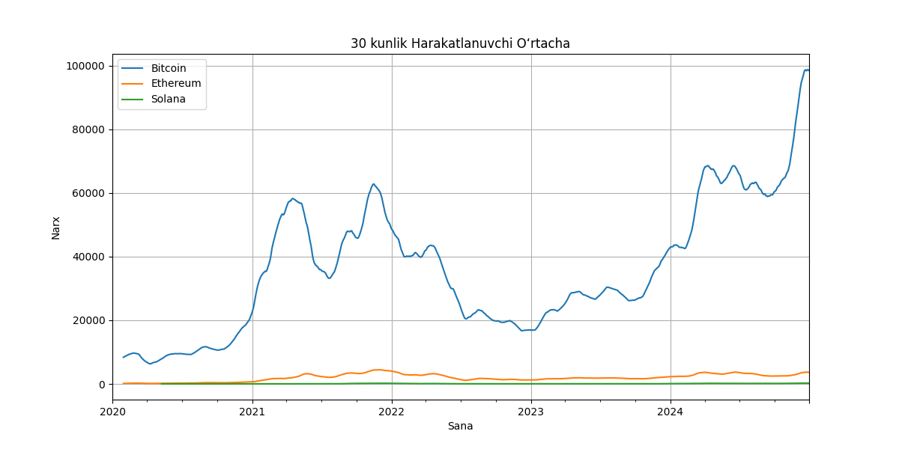

# 📊 Kriptovalyutalar Narxi Tahlili

Ushbu loyiha `Bitcoin (BTC)`, `Ethereum (ETH)` va `Solana (SOL)` kriptovalyutalari asosida tahlil o‘tkazish uchun tayyorlangan. Ma’lumotlar `Yahoo Finance` orqali yuklab olingan va `Pandas`, `Matplotlib`, `Seaborn` kutubxonalari yordamida vizual tahlil qilindi.

---

## 📈 Narxlar Trend Grafigi

🔹 Har uchala kriptovalyutaning vaqt bo‘yicha narxlar o‘zgarishi ko‘rsatilgan.  
🔹 Solana narxi 2021-yilda keskin o‘sgan, lekin so‘ngra tushgan.

---

## 💰 ROI (Return on Investment)

🔹 Har bir kriptovalyutaning boshlang‘ich davrdan boshlab o‘sish foizi.  
🔹 Solana qisqa muddatda eng yuqori ROI ko‘rsatgan, lekin so‘nggi yillarda barqaror emas.

---

## 📉 Oylik Volatilite

🔹 Volatilite – narxdagi tebranish darajasini ko‘rsatadi.  
🔹 Solana va Ethereum volatilitesi nisbatan yuqori.

---

## 🔁 Korrelyatsiya (O‘zaro bog‘liqlik)

🔹 Bitcoin va Ethereum o‘rtasida kuchli korrelyatsiya mavjud.  
🔹 Solana esa unchalik ham kuchli bog‘liqlikka ega emas.

---

## 📊 30 Kunlik Harakatlanuvchi O‘rtacha

🔹 Bu grafik har bir kriptovalyutaning 30 kunlik narx o‘rtachasini ko‘rsatadi.  
🔹 Narxlardagi keskin o‘zgarishlarni yumshatishda foydali.

---

## 📁 Loyihadagi fayllar:

- `crypto_price_analysis.ipynb` – Asosiy tahlil notebuki
- `images/` – Grafiklar papkasi
- `README.md` – Loyihaning tavsif fayli

---

## 📌 Foydalanilgan kutubxonalar:

- `pandas`
- `matplotlib`
- `seaborn`
- `yfinance`

---

## ✨ Xulosa

Ushbu tahlil orqali kriptovalyutalarning o‘zaro aloqasi, risk darajasi va investitsiya imkoniyatlarini baholash mumkin bo‘ldi.
